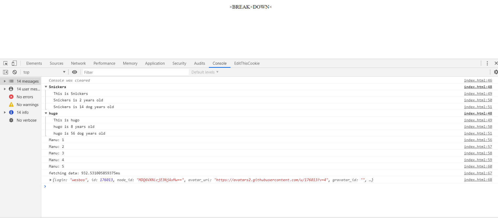
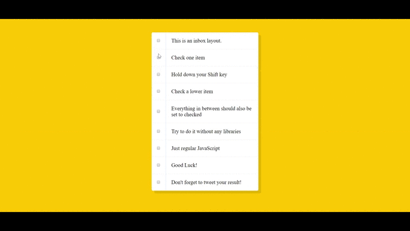
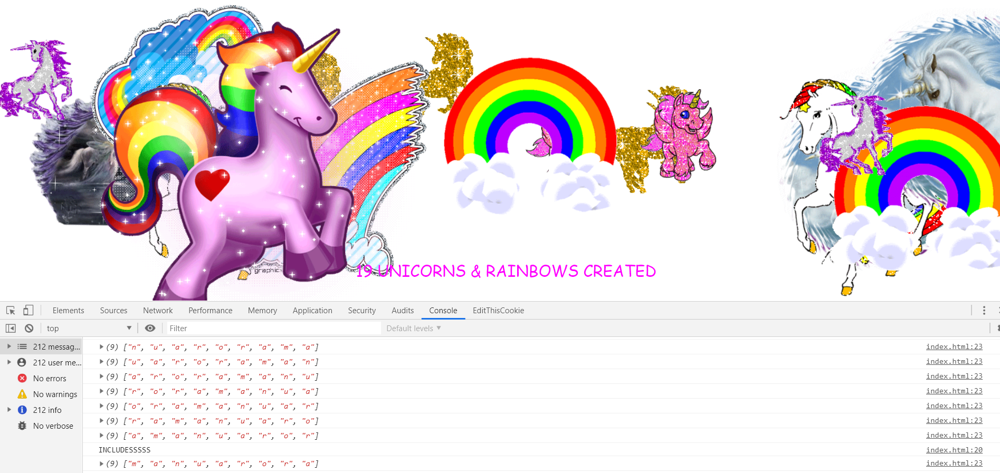

# JavaScript 30

```
int main() {
	printf("30 JavaScript projects without any external libraries.");
}
```
>30 JavaScript projects without any external libraries.

# Screenshots and Explanations

### 01 - JavaScript Drum Kit
Play **Drums**. Bleh.   
**takeaway** - `playSound()` function.


### 02 - JavaScript and CSS Clock
A minimal JS and CSS clock which displays three hands.   
**takeaway** -- `setDate()` function.


### 03 - CSS variables with Javascript
Play with the CSS variables options to resize an image, Blur and image and change border color using **sliders**.   
**takeaway** - `addEventListener()` helper method.


### 05 - Flex Panel Gallery
CSS flexbox is awesome. here, click on an image and watch the text roll in and the image expand.   

**takeaway** - `display: flex;` property.


### 06 - AJAX Type head
Type in a name of a **city** or a **state** and the results will start rolling as soon as you type. Also there is a feature to highlight the text which you're looking for.   
**takeaway** - `fetch()` and `promises` from JavaScript.


### 07 - Array Cardio Part two
Implemented `find()`, `some()`, `every()` and `findIndex()` methods to play with arrays.     
**takeaway** - All the above mentioned functions.


### 08 - Fun with HTML5 Canvas
Draw on the Canvas element by holding on the mouse pointer. The colors vary along with the width. Give it a try. :p        
**takeaway** - `draw()` method is helpful for drawing onto the canvas. `decision` flag helps to reduce and increase width of the `stroke` element.


### 09 - Dev Tools Fun
Trying to build a strong grip on various `console` statements.             
**takeaway** - All `console` Statements 



### 10 - Hold Down Shift Key To Select Multiple Checkboxes
Hold down the `shift` key on your keyboard and select another checkbox in the list. All the checkboxes in between will get checked automatically (Gmail feature).   
**takeaway** - the `inBetween` flag is the most useful here. Also, the `handleCheckboxes` function is handy.   



### 11 - Custom HTML5/CSS3/JS Video player
A video player with features such as `play`, `pause`, `skip 10 seconds backwords`, `skip 25 seconds forward` and a `seek bar`. All this is implemented in `scripts.js` file with some custom css in `style.css` file.   
**takeaway** - `addEventListener()` method plays a major role in binding DOM keys with functions. The respective functions control their respective functionalities. for example `scrub()` is responsible to adjust seek bar to the exact correct location.


---

### 12 - Key Sequence Detection
Detects a specific keysequence when the user enters keystores onto the browser window. Key sequence is then mapped with the secret code and the output is generated, in this case, UNICORNS.     
**takeaway** - The `cornify_add()` method adds unicorns. Basically we check for the `pressed` array and map it with `secretCode` array.

