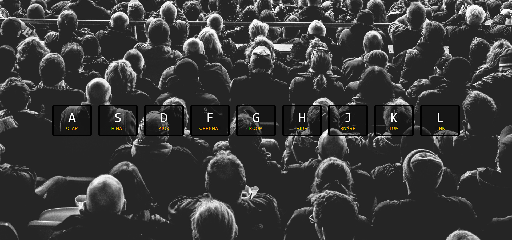

# JavaScript 30

```
int main() {
	printf("30 JavaScript projects without any external libraries.");
}
```
>30 JavaScript projects without any external libraries.

# Screenshots and Explanations

### 01 - JavaScript Drum Kit
Play **Drums**. Bleh.   
**takeaway** - `playSound()` function.



### 02 - JavaScript and CSS Clock
A minimal JS and CSS clock which displays three hands.   
**takeaway** -- `setDate()` function.


### 03 - CSS variables with Javascript
Play with the CSS variables options to resize an image, Blur and image and change border color using **sliders**.   
**takeaway** - `addEventListener()` helper method.


### 05 - Flex Panel Gallery
CSS flexbox is awesome. here, click on an image and watch the text roll in and the image expand.   

**takeaway** - `display: flex;` property.


### 06 - AJAX Type head
Type in a name of a **city** or a **state** and the results will start rolling as soon as you type. Also there is a feature to highlight the text which you're looking for.   
**takeaway** - `fetch()` and `promises` from JavaScript.


### 07 - Array Cardio Part two
Implemented `find()`, `some()`, `every()` and `findIndex()` methods to play with arrays.     
**takeaway** - All the above mentioned functions.

